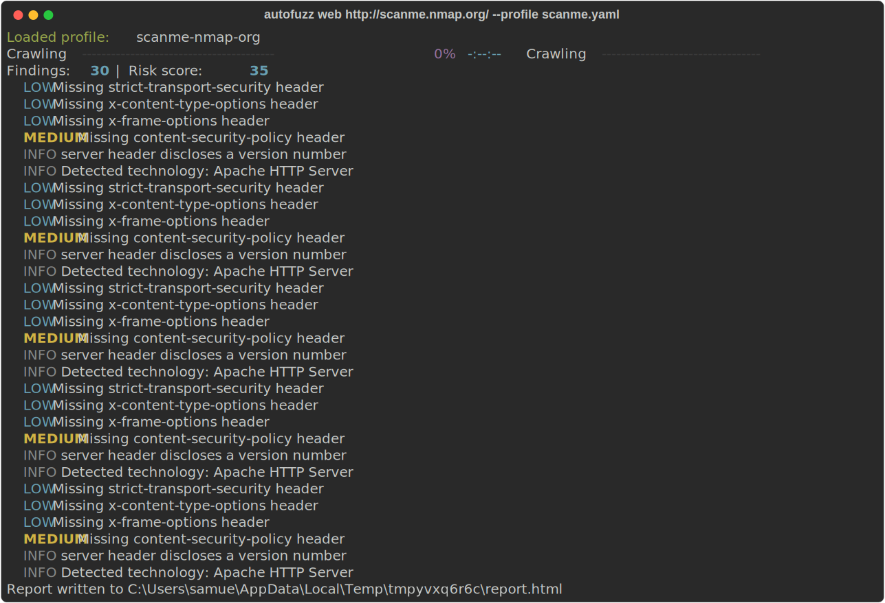
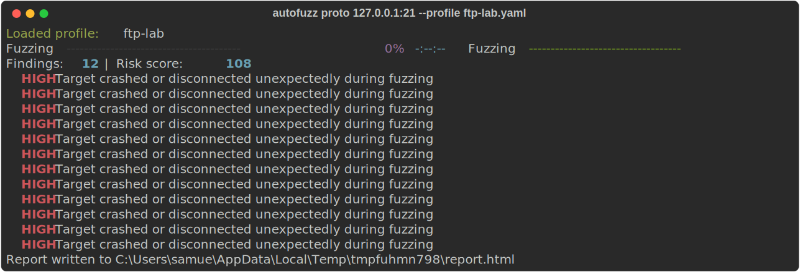

# AutoFuzz


AutoFuzz is a modular security testing framework with two engines sharing
one core: a **Protocol Fuzzing Engine** (FSM-guided, mutation-driven fuzzing
of text-based network protocols) and a **Web Assessment Engine** (crawler +
passive analysis plugins for authorized HTTP/HTTPS targets). Both share the
same scheduler, scan-session lifecycle, plugin registry, and reporting
pipeline, and both are driven by a single CLI.

> **⚠️ Authorized use only**
>
> AutoFuzz sends aggressive, malformed, and high-volume input at real
> network services. Every scan profile requires an explicit
> `authorized: true` field, and the CLI refuses to run without it — but
> that flag is not a substitute for actually having permission. Only point
> AutoFuzz at systems you own or are explicitly authorized to test. See
> [docs/ethics.md](docs/ethics.md) for the full policy.

---

## What it looks like

**Web Assessment Engine** — crawling a target and reporting findings:



**Protocol Fuzzing Engine** — mutating FTP commands and catching a crash:



---

## Features

- **Two engines, one core** — a shared `WorkerPool` (bounded concurrency,
  rate limiting, retries), `ScanSession` lifecycle (with resume/history),
  and reporting pipeline back both engines.
- **Protocol Fuzzing Engine** — FSM-guided command sequencing, 18 mutation
  strategies (buffer overflows, null-byte floods, path traversal, format
  string probes, and more), pluggable transport adapters (FTP shipped;
  add your own — see [docs/developer-guide.md](docs/developer-guide.md)),
  and crash classification that distinguishes real faults from timeouts
  and protocol-level rejections.
- **Web Assessment Engine** — bounded breadth-first crawler, passive
  plugins (missing security headers, insecure cookie attributes, server
  version disclosure), technology fingerprinting, and endpoint/parameter
  discovery.
- **Reporting** — HTML, Markdown, JSON, and CSV report output with a
  computed risk score.
- **Resume & history** — `autofuzz history` lists past scans;
  `autofuzz resume <scan-id>` continues an interrupted protocol fuzzing
  run from its last checkpoint.
- **DevSecOps built in** — CI (lint/type-check/tests/build), CodeQL,
  Semgrep, pip-audit, Trivy, and SBOM/release automation. See
  [.github/workflows/](.github/workflows/).
- **Docker-ready** — a hardened, non-root container image and a
  Docker Compose lab (AutoFuzz + a disposable vulnerable FTP target).

---

## Requirements

- Python 3.10+
- Docker (optional — only needed for the FTP lab target or for running
  AutoFuzz itself in a container)

---

## Quickstart

### Install

```bash
pip install -e .
```

### Run a web assessment scan

```bash
autofuzz web https://target.example --profile examples/configs/web-default.yaml
```

Crawls the target (same-origin, depth- and page-bounded), runs the
built-in passive plugins and technology fingerprinting against every page,
prints a findings summary, and writes an HTML report.

### Run a protocol fuzzing scan

First stand up the disposable, intentionally-vulnerable FTP lab target:

```bash
cd docker/labs/ftp-vsftpd/
docker build -t autofuzz-ftp .
docker run -d --name autofuzz-ftp-container -p 21:21 -p 30000-30009:30000-30009 autofuzz-ftp
```

Then fuzz it:

```bash
autofuzz proto 127.0.0.1:21 --profile examples/configs/ftp-lab.yaml
```

Mutates FTP command sequences, sends them concurrently, restarts the
target container if it goes down (`target_controller: docker` in the
profile), classifies crashes, and writes a report.

### Shorthand

`autofuzz <target>` auto-detects the engine: a URL implies `web`, anything
else implies `proto`.

```bash
autofuzz https://target.example --profile examples/configs/web-default.yaml
```

### History and resume

```bash
autofuzz history
autofuzz resume <scan-id>
```

See [docs/user-guide.md](docs/user-guide.md) for the full CLI reference
and scan profile schema.

---

## Docker Compose

To run the FTP lab and AutoFuzz itself in containers instead of installing
locally:

```bash
cd docker
docker compose up -d ftp-lab
docker compose run --rm autofuzz proto ftp-lab:21 \
  --profile /home/autofuzz/configs/ftp-lab-compose.yaml \
  -o /home/autofuzz/reports/report.html
docker compose down
```

See [docker/docker-compose.yml](docker/docker-compose.yml) for the full
setup and [.env.example](.env.example) for the environment variables
AutoFuzz reads (all optional, all have working defaults).

---

## Documentation

- [docs/architecture.md](docs/architecture.md) — how the two engines and
  shared core fit together
- [docs/user-guide.md](docs/user-guide.md) — CLI reference and scan
  profile schema
- [docs/developer-guide.md](docs/developer-guide.md) — adding a plugin,
  mutator, or protocol adapter
- [docs/ethics.md](docs/ethics.md) — authorized-use policy
- [CONTRIBUTING.md](CONTRIBUTING.md) — development setup and workflow
- [CHANGELOG.md](CHANGELOG.md) — release history
- [examples/ci/scheduled-web-scan.yml](examples/ci/scheduled-web-scan.yml) —
  a template for running an authorized, scheduled web assessment from your
  own GitHub Actions workflow

---

## License

MIT — see [LICENSE](LICENSE).
